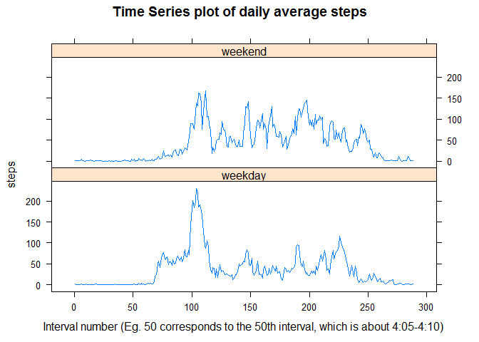

# Reproducible Research: Peer Assessment 1


## Loading and preprocessing the data

Setting up my directory (change this to where your data is at to run the code)


```r
directory <- "C:/Users/Mikkel.A.Lilja/Desktop/Coursera/reproducibleResearch/RepData_PeerAssessment1"
setwd(directory)
```

Loading the dataset.


```r
act <- read.csv("activity/activity.csv")
```

## What is mean total number of steps taken per day?

I use the functions lapply and split to calculate the mean total number of steps.
Some of the days have NA's as total number of steps, and whilst I could've chosen
to set these to zero and include them in the mean, I have chosen to remove them from
the mean, since a total number of steps equal to zero doesnt make much sense.


Here are the results:


```r
meanTotalSteps; medianTotalSteps
```

```
## [1] 10766.19
```

```
## [1] 10765
```

And here is the histogram of total steps


```r
hist(unlist(totalSteps), breaks = 10, main = "Histogram of total steps taken by day", col = "green", xlab = "Daily total steps")
rug(unlist(totalSteps))
```

 

## What is the average daily activity pattern?

Uses the same functions as earlier to create a list of interval-averages steps, and plots the result as a timeseries.

```r
intervals <- as.factor(unique(act$interval))
meanStepsPrInterval <- with(act, lapply(split(steps, interval), FUN = mean, na.rm = T))
plot(intervals, meanStepsPrInterval, main ="Time Series plot of daily average steps", col = "blue", lwd = 2, type = "l", xlab = "Interval number (Eg. 50 corresponds to the 50th interval, which is about 4:05-4:10)")
```

 

Note: It is important to plot the intervals as factors, and not numbers, since if you plot it as numbers
you will see a 'stretched' plot, as you have data from for instance 0,5,10,...,60 but not 65,70,...,95,
and you will get a 'jumpy' plot, as below in red, see if you can spot see the difference:

 

Here is a computation showing that the average person takes the most steps in the interval 8:35-8:40:


```r
topSteps <- unlist(meanStepsPrInterval)
bestIntervalIndex <- which(topSteps == max(topSteps))
unique(act$interval)[bestIntervalIndex]
```

```
## [1] 835
```

## Imputing missing values

The total number of rows with missing values is

```r
indexOfNa <- which(is.na(act$steps))
length(indexOfNa)
```

```
## [1] 2304
```
        
My strategy for imputing the missing values is to impute them with the average number of steps taken in that interval. I do this by first adding a new column to the data frame to store the imputed values and then i add a column with the average number of steps for each rows particular interval. The length of the meanStepsPrInterval-vector is a multiple of the length of act$meanSteps, so R just repeats the shorter vector until the data frame column is filled out, which is exactly what we want in this case.


```r
act$stepsImputed <- act$steps
act$meanSteps <- meanStepsPrInterval
for (i in indexOfNa) {
     act$stepsImputed[i] <- act$meanSteps[[i]]   
}
```

I now have a data frame with both the original data, the imputed data and the mean steps for each interval. The assignment wants me to report a new dataset equal to the original, but with imputed data. So here we go:


```r
actImputed <- data.frame(steps = act$stepsImputed, date = act$date, interval = act$interval)
head(actImputed, n = 3)
```

```
##       steps       date interval
## 1 1.7169811 2012-10-01        0
## 2 0.3396226 2012-10-01        5
## 3 0.1320755 2012-10-01       10
```

Here is a histogram as we saw earlier, but with the imputed data:


```r
totalStepsImputed <- with(actImputed, lapply(split(steps, date), FUN = sum), na.rm = T)
hist(unlist(totalStepsImputed), breaks = 10, main = "Histogram of total steps taken by day (with NAs imputed)", col = "blue", xlab = "Daily total steps")
rug(unlist(totalStepsImputed))
```

 

```r
meanTotalStepsI <- mean(unlist(totalStepsImputed))
medianTotalStepsI <- median(unlist(totalStepsImputed))
```

And here is the mean and median with the imputed data:


```r
meanTotalStepsI; medianTotalStepsI
```

```
## [1] 10766.19
```

```
## [1] 10766.19
```

We se that the mean doesnt change (which makes sense, since we've imputed the data with interval means), but that the median chances and is now the same as the mean.
The impact of imputing the data is that we get a histogram with the same bell shape, but with a lower variance, the histogram is more centered around the mean, making the estimate for the total daily number of steps more clear. 

## Are there differences in activity patterns between weekdays and weekends?

I add a column to the imputed data frame that contains the day of the week for the date.
I then subset the data frame in to two data frames, one containing all the weekend data, one containing all the weekday data.


```r
actImputed$date <- as.Date(actImputed$date)
actImputed$weekday <- weekdays(actImputed$date)
actWeekend <- subset(actImputed, weekday %in% c("lørdag", "søndag"))
actWeekday <- subset(actImputed, !(weekday %in% c("lørdag", "søndag")))
```

I compute the mean steps pr interval for both weekends and weekdays, creates a new data frame with the mean steps, intervals and a factor for weekend/weekday, and uses the lattice xyplot to create the plot.


```r
library(lattice)
meanStepsPrIntervalWeekend <- with(actWeekend, lapply(split(steps, interval), FUN = mean, na.rm = T))
meanStepsPrIntervalWeekday <- with(actWeekday, lapply(split(steps, interval), FUN = mean, na.rm = T))

dataframe <- data.frame(steps = c(unlist(meanStepsPrIntervalWeekday), unlist(meanStepsPrIntervalWeekend)), interval = c(intervals, intervals), daytype = rep(c("weekday", "weekend"), each = 288))

xyplot(steps ~ interval | daytype, data = dataframe, main ="Time Series plot of daily average steps", type = "l", xlab = "Interval number (Eg. 50 corresponds to the 50th interval, which is about 4:05-4:10)", layout = c(1,2))
```

 


